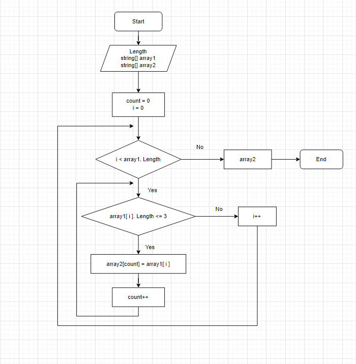

# Итоговая работа

## Задача

Написать программу, которая из имеющегося массива строк формирует массив из строк, длина которых меньше либо равна 3 символа. Первоначальный массив можно ввести с клавиатуры, либо задать на старте выполнения алгоритма. 

## Решение

1. Пользователь вводит массив с клавиатуры.
2. Инициализируем два массива: **пользовательский и результирующий**.
3. Определяем размер массива путем проверки количества символов, выбираем те, где их меньше или равно 3.
4. Собираем **результирующий массив** из элементов, подходящий нам по условию. 
5. Выводим в консоль **результирующий массив**.

## Блок-схема
 

 
